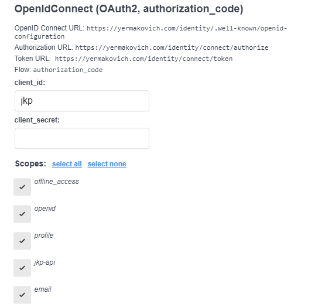

# barcode-api

## API Authentication

This API uses authentication provided by `yermakovich.com` identity service.

In order to authenticate you will need to use the `authorization_code` Oauth2 flow.
Fill in the `client_id` as `jkp` and leave the secret empty. After that you will be redirected to the `yermakovich.com` login page.

After successful login you will land back in the docs authenticated.
